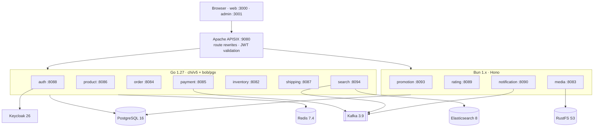

# 🛒 E-Commerce Cloud-Native Microservices Platform

<p align="center">
  <picture>
    <source media="(prefers-color-scheme: light)" srcset="https://socialify.git.ci/Ecommerce-INT/ecommerce-microservices/image?description=1&descriptionEditable=%E2%9A%A1%EF%B8%8F%2011%20Microservices%20%E2%80%A2%20Golang%201.27%20%E2%80%A2%20Bun%20%E2%80%A2%20Kubernetes&font=Inter&forks=1&language=1&owner=1&pattern=Floating%20Cogs&pulls=1&stargazers=1&theme=Light"/>
    <source media="(prefers-color-scheme: dark)" srcset="https://socialify.git.ci/Ecommerce-INT/ecommerce-microservices/image?description=1&descriptionEditable=%E2%9A%A1%EF%B8%8F%2011%20Microservices%20%E2%80%A2%20Golang%201.27%20%E2%80%A2%20Bun%20%E2%80%A2%20Kubernetes&font=Inter&forks=1&language=1&owner=1&pattern=Floating%20Cogs&pulls=1&stargazers=1&theme=Dark"/>
    
  </picture>
</p>

<p align="center">
  <a href="LICENSE">
    
  </a>
  
  
  
  
  
  
</p>

---

## 📋 Overview

**ecommerce-microservices** is a production-grade, ultra-lightweight e-commerce platform built as **11 cloud-native microservices** plus **2 Next.js frontends**:

- **7 Go services** (`Go 1.27`) in a single `go.work` workspace — [`go-chi/chi/v5`](https://github.com/go-chi/chi) for HTTP routing, [`stephenafamo/bob`](https://github.com/stephenafamo/bob) v0.50 as the PostgreSQL query builder on top of [`jackc/pgx/v5`](https://github.com/jackc/pgx) v5.11.
- **4 Bun / TypeScript services** — Hono + zod over **Drizzle v1** (`drizzle-orm/bun-sql`, RC) on Bun's native PostgreSQL (`Bun.sql`) and S3 (`Bun.S3Client`) clients (KafkaJS + Nodemailer where needed).
- **2 Next.js 16 apps** (storefront + backoffice) in a pnpm + Turborepo monorepo.
- **Infrastructure** — PostgreSQL 16, Redis 7.4, Apache Kafka 3.9 (KRaft), Elasticsearch 8.15, RustFS (S3-compatible), Keycloak 26 (OIDC) and Apache APISIX as the edge gateway. Docker Compose runs everything locally; Kubernetes manifests (k3d) cover cluster runs.
- **Design targets** — sub-50 ms cold starts and a fraction of the previous JVM footprint. The full target-state architecture (NATS JetStream, Better-Auth, OpenSearch 3.9, PostgreSQL 18 on CNPG, Valkey, SvelteKit, Cilium + Gateway API, a dedicated GitOps repo) is documented in **[docs/architecture-revamp-plan.md](docs/architecture-revamp-plan.md)**.

## 🏗️ Architecture



Browser traffic reaches the gateway at `/api/*` and `/storefront/*`; APISIX rewrites each route to the owning service (for example `/api/products` → `product-service` `/product/api/products`) and validates Keycloak-issued JWTs on protected routes.

## 🧱 Tech Stack

| Layer | Technology |
| :--- | :--- |
| **Go HTTP** | `go-chi/chi/v5` router, `go-chi/cors`, standard `net/http` (`context.Context` end-to-end) |
| **Go data access** | `stephenafamo/bob` v0.50 query builder (`dialect/psql`) over `jackc/pgx/v5` v5.11 (`pgxpool`) |
| **Bun services** | Hono, zod · Drizzle v1 (`drizzle-orm/bun-sql`, RC) on native `Bun.sql` · `Bun.S3Client` · KafkaJS · Nodemailer |
| **Messaging** | Apache Kafka 3.9 (KRaft mode) |
| **Search** | Elasticsearch 8.15 |
| **Cache** | Redis 7.4 |
| **Object storage** | RustFS (S3-compatible) |
| **Identity** | Keycloak 26 (OIDC / JWT, SSO ticket exchange) |
| **API gateway** | Apache APISIX 3.15 (`:9080`) |
| **Frontend** | Next.js 16, React 19, Tailwind CSS 4, TanStack Query, next-intl, Turborepo + pnpm |
| **Local orchestration** | Docker Compose (infra + 11 services + frontend) |
| **Cluster** | k3d / k3s on Docker or Podman (auto-detected), manifests under `k8s/` |

## 🧩 Services

| # | Microservice | Runtime / Stack | Port | Responsibilities & Domain |
| :- | :--- | :--- | :--- | :--- |
| **1** | **`auth-service`** | Go 1.27 · chi/v5 · bob/pgx | `8088` | Keycloak OIDC callback, SSO ticket exchange, User & Role CRUD. |
| **2** | **`product-service`** | Go 1.27 · chi/v5 · bob/pgx | `8086` | Catalog, Categories, Brands, **User Favourites / Wishlists** (merged from `favourite-service`). |
| **3** | **`order-service`** | Go 1.27 · chi/v5 · bob/pgx | `8084` | Shopping Cart, Order creation, Checkout lifecycle, **OrderItem tracking**. |
| **4** | **`payment-service`** | Go 1.27 · chi/v5 · bob/pgx · Kafka | `8085` | Payment transactions, Kafka event publisher, payment status callbacks. |
| **5** | **`inventory-service`** | Go 1.27 · chi/v5 · bob/pgx | `8082` | Batch stock queries, stock reservations, warehouse ledger. |
| **6** | **`shipping-service`** | Go 1.27 · chi/v5 · bob/pgx | `8087` | Shipping fee quotes, carrier management, shipment lifecycle. |
| **7** | **`search-service`** | Go 1.27 · chi/v5 · Elasticsearch 8 | `8094` | Full-text catalog search, auto-complete suggestions, Kafka consumer sync. |
| **8** | **`promotion-service`** | Bun 1.x · Hono · Drizzle (Bun.sql) | `8093` | Coupons, discount rules, **Tax Classes & Tax Rates calculation** (merged from `tax-service`). |
| **9** | **`rating-service`** | Bun 1.x · Hono · Drizzle (Bun.sql) | `8089` | Product reviews, verified purchases, star rating aggregates. |
| **10** | **`media-service`** | Bun 1.x · Hono · Drizzle (Bun.sql) + Bun.S3Client | `8083` | Multipart file upload, RustFS (S3) stream, presigned upload URLs. |
| **11** | **`notification-service`** | Bun 1.x · Hono · Drizzle (Bun.sql) · KafkaJS | `8090` | Transactional email dispatches, Kafka notification consumer, in-app inbox. |

**Bun service databases** — queries go through Drizzle v1 (`src/schema.ts` is the typed source of truth) on Bun's native `Bun.sql`. Tables are created at boot by `initDb()` in `src/db.ts` with idempotent `CREATE TABLE IF NOT EXISTS` statements, so a fresh database needs no migration step; when you add a column or table, update `src/schema.ts` and the matching DDL in `db.ts` together. Generated `drizzle/` output stays local (gitignored). Typecheck with `bun run typecheck`.

**Frontend apps** (pnpm workspace under `frontend/`):

| App | Stack | Port | Purpose |
| :--- | :--- | :--- | :--- |
| **`apps/web`** | Next.js 16 · React 19 · Tailwind 4 | `3000` | Customer storefront (catalog, cart, checkout, orders). |
| **`apps/admin`** | Next.js 16 · React 19 · Tailwind 4 | `3001` | Backoffice (products, categories, orders, users, settings). |

## 📁 Project Structure

```text
ecommerce-microservices/
├── auth-service/                   # Go · port 8088
├── product-service/                # Go · port 8086 (includes favourites)
├── order-service/                  # Go · port 8084
├── payment-service/                # Go · port 8085
├── inventory-service/              # Go · port 8082
├── shipping-service/               # Go · port 8087
├── search-service/                 # Go · port 8094
├── promotion-service/              # Bun / TS · port 8093 (includes taxes)
├── rating-service/                 # Bun / TS · port 8089
├── media-service/                  # Bun / TS · port 8083
├── notification-service/           # Bun / TS · port 8090
├── pkg/common/                     # Shared Go module (config, database, middleware, response)
├── frontend/                       # pnpm + Turborepo workspace
│   ├── apps/web/                   # Next.js storefront (:3000)
│   ├── apps/admin/                 # Next.js backoffice (:3001)
│   └── packages/                   # Shared UI, API client and config packages
├── deploy/apisix/                  # Apache APISIX gateway configuration
├── docker/                         # Postgres init scripts & Keycloak realm import
├── k8s/                            # Kubernetes manifests (infra, backend, frontend, ingress)
├── scripts/dev.ps1                 # Windows task runner (mirrors the Makefile)
├── go.work                         # Go workspace (8 modules)
├── Makefile                        # Build / test / run workflows
├── docker-compose.yml              # 11 services + infra + frontend
└── README.md
```

## ✅ Prerequisites

| Tool | Version | Needed for |
| :--- | :--- | :--- |
| [Go](https://go.dev/dl/) | 1.27+ | The 7 Go services + `pkg/common` |
| [Bun](https://bun.sh/) | 1.4+ | The 4 TypeScript services (native `Bun.sql` + `Bun.S3Client` need ≥ 1.2) |
| [Docker](https://docs.docker.com/get-docker/) + Compose v2 | recent | Full stack or infra containers (Postgres, Kafka, Keycloak, …) |
| [Node.js](https://nodejs.org/) + pnpm 10 | Node 20+ | Next.js frontends (`corepack enable` provides pnpm) |
| GNU make | 3.81+ | Task runner on Linux / macOS / WSL / Git Bash |
| PowerShell 5.1+ | built in | Task runner on Windows (`scripts/dev.ps1`) |
| k3d + kubectl | latest | Optional — k3d cluster (`start-ecommerce.*`); uses Docker Desktop or Podman |

## 🚀 Quick Start

### 1. Full stack with Docker Compose

```bash
# .env ships with development defaults (DB credentials, Keycloak realm, mail, …)
docker compose up -d --build       # or: make up
```

| URL | What |
| :--- | :--- |
| `http://localhost:9080` | API gateway (APISIX) |
| `http://localhost:3000` | Storefront |
| `http://localhost:8080` | Keycloak admin console (`admin` / `admin`) |
| `http://localhost:9091` | APISIX Prometheus metrics |

`docker compose ps` shows all 19 containers (7 infra + 11 services + frontend). The `frontend` container uses the published `ghcr.io/hoangtien2k3/frontend` image; run the apps from source for frontend development.

### 2. Infra in Docker, services on the host

```bash
make infra-up                      # postgres, redis, kafka, elasticsearch, rustfs, keycloak, apisix
make go-run SVC=product-service    # one Go service (defaults already target localhost)
make bun-dev SVC=rating-service    # one Bun service in watch mode
```

> Tip: services read the same variables as `.env` (`POSTGRES_*`, `KAFKA_SERVERS`, `ELASTICSEARCH_*`, `KEYCLOAK_*`, `STORAGE_*`) and fall back to localhost defaults, so no exports are required for the common case.

### 3. Frontend

```bash
make web-install                   # pnpm install (workspace root)
make web-dev                       # both apps: web :3000, admin :3001
```

The browser calls the gateway directly. Point `NEXT_PUBLIC_API_URL` (in `frontend/apps/web/.env` / `apps/admin/.env`) at whatever backend is running — `http://api.ecommerce.local` for the k3d cluster, or your local gateway URL.

### 4. Kubernetes (k3d — optional)

One command creates the k3d cluster and applies every manifest (infra, gateway, services, frontends). The container runtime is auto-detected — **Docker Desktop or Podman** (Podman machines are configured rootful automatically):

```bash
# Windows
start-ecommerce.bat                 # force a runtime: start-ecommerce.bat -Runtime podman

# Linux / macOS / WSL / Git Bash
./start-ecommerce.sh                # force a runtime: RUNTIME=podman ./start-ecommerce.sh

# or through the task runners
make cluster-up                     # bash k3d-setup.sh
.\scripts\dev.ps1 cluster-up        # k3d-setup.ps1
```

Then map the hostnames (the Windows script offers to update the hosts file — run it elevated):
`127.0.0.1 ecommerce.local admin.ecommerce.local api.ecommerce.local keycloak.ecommerce.local rustfs.ecommerce.local`

Storefront `http://ecommerce.local` · backoffice `http://admin.ecommerce.local` · gateway `http://api.ecommerce.local`.

## 🧰 Developer Workflow

Every workflow is available through **make** (Linux, macOS, WSL, Git Bash, CI) and through **`scripts/dev.ps1`** (native Windows PowerShell) — the two are 1:1 equivalents:

| Task | make | Windows (PowerShell) |
| :--- | :--- | :--- |
| Show every target | `make help` | `.\scripts\dev.ps1 help` |
| Build all Go modules | `make build` | `.\scripts\dev.ps1 build` |
| Run all tests (Go + Bun) | `make test` | `.\scripts\dev.ps1 test` |
| Full check (fmt + vet + tests) | `make check` | `.\scripts\dev.ps1 check` |
| Go vet / format / tidy | `make go-vet`, `make go-fmt`, `make go-tidy` | `.\scripts\dev.ps1 go-vet`, … |
| Run one Go service | `make go-run SVC=product-service` | `.\scripts\dev.ps1 go-run product-service` |
| Run one Bun service | `make bun-dev SVC=rating-service` | `.\scripts\dev.ps1 bun-dev rating-service` |
| Start the stack | `make up` / `make infra-up` | `.\scripts\dev.ps1 up` / `infra-up` |
| One-shot k3d cluster | `make cluster-up` | `.\scripts\dev.ps1 cluster-up` |
| Logs / status / restart | `make logs SVC=…`, `make ps`, `make restart SVC=…` | `.\scripts\dev.ps1 logs …`, … |

Raw commands work too — the repo root is **not** a Go module, so list the workspace modules explicitly:

```bash
go build ./auth-service/... ./product-service/... ./order-service/... ./payment-service/... \
  ./inventory-service/... ./shipping-service/... ./search-service/... ./pkg/common/...
go test  ./auth-service/... ./product-service/... ./order-service/... ./payment-service/... \
  ./inventory-service/... ./shipping-service/... ./search-service/... ./pkg/common/...
```

## 🧪 Testing

```bash
make go-test      # go test across all 8 modules
make bun-test     # bun install + bun test in the 4 TypeScript services
make check        # gofmt -l + go vet + all of the above
cd frontend && pnpm typecheck && pnpm lint
```

## ⚙️ Configuration

`.env` holds development defaults. The variables consumed by today's Go/Bun services:

| Group | Variables | Used by |
| :--- | :--- | :--- |
| PostgreSQL | `POSTGRES_USER`, `POSTGRES_PASSWORD`, `POSTGRES_HOST`, `POSTGRES_PORT`, `DATABASE_URL` (override) | All services (per-service databases, created by `docker/postgres/init/create-all-databases.sql`) |
| Redis | `REDIS_HOST`, `REDIS_PORT`, `REDIS_PASSWORD` | Compose infrastructure |
| Kafka | `KAFKA_SERVERS` | `payment-service`, `search-service`, `notification-service` |
| Elasticsearch | `ELASTICSEARCH_URL`, `ELASTICSEARCH_USERNAME`, `ELASTICSEARCH_PASSWORD` | `search-service` |
| Object storage | `STORAGE_ENDPOINT`, `STORAGE_REGION`, `STORAGE_ACCESS_KEY`, `STORAGE_SECRET_KEY`, `STORAGE_BUCKET` | `media-service` (RustFS) |
| Keycloak / SSO | `KEYCLOAK_*`, `SSO_BACKEND_CALLBACK_URL`, `SSO_DEFAULT_FRONTEND_REDIRECT` | `auth-service` |
| Mail | `MAIL_USERNAME`, `MAIL_PASSWORD` | `notification-service` |

The remaining Spring-era entries (`EUREKA_URI`, `ECOMMERCE_*`, `REST_CLIENT_*`, `I18N_*`, `HTTP_LOG_*`, `WEB_*`) are unused by the Go/Bun services and will be pruned as the migration lands.

## 🩺 Health Checks & Observability

Every microservice exposes Spring Boot Actuator–compatible health endpoints:

- `GET /actuator/health` → `{"status":"UP","components":{...}}`
- `GET /{service-name}/actuator/health` → same payload
- `X-Correlation-Id` is generated (or forwarded) on every request and returned in responses; the user-facing JSON envelope (`response.ApiResponse`) also carries it as `traceId`.
- APISIX exposes Prometheus metrics on `:9091` for gateway-level traffic.

## 🗺️ Roadmap

The current stack still runs Kafka, Elasticsearch, Keycloak and Next.js; the revamp replaces them stage by stage. See **[docs/architecture-revamp-plan.md](docs/architecture-revamp-plan.md)** for the full design and the k6 benchmark plan:

1. NATS JetStream in place of Kafka (event streams + request/reply RPC)
2. Better-Auth replacing Keycloak inside `auth-service`
3. OpenSearch 3.9 replacing Elasticsearch (hybrid search + AI RAG)
4. PostgreSQL 18 on CloudNativePG + Valkey 9.1 replacing the single-node Postgres/Redis
5. SvelteKit 5 storefront/backoffice replacing Next.js
6. Dedicated `ecommerce-gitops` repo: Cilium, OpenEBS, Gateway API, ArgoCD `ApplicationSet`

## 📄 License

MIT License.
