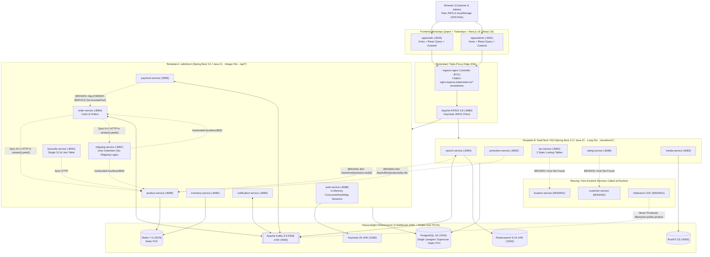
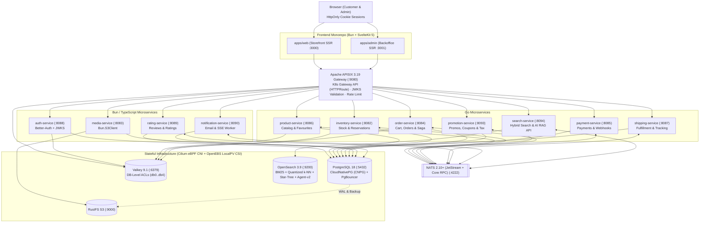

# E-Commerce Microservices Architecture Revamp Plan

## 1. Executive Summary

This document outlines the architectural revamp of the **ecommerce-microservices** platform, transitioning from a heavyweight, partially broken **13-service Java/Spring Boot + Next.js + Keycloak + Kafka + Elasticsearch** stack to a cohesive, cloud-native **11-service Go + Bun/TypeScript + SvelteKit + Better-Auth + NATS JetStream + OpenSearch 3.9** architecture.

| Layer | Current Stack | Target Stack | Primary Gain |
| :--- | :--- | :--- | :--- |
| **Frontend Monorepo** | Next.js 16 (React 19), Zustand, TanStack Query, Axios, pnpm | **SvelteKit 5 (Runes)**, Tailwind CSS 4, **Bun Workspaces** | ~70% smaller client bundles, true SSR `load`/Form Actions, `HttpOnly` cookie auth |
| **API Gateway & K8s Edge** | NGINX Ingress (`ingress-nginx`) + Apache APISIX 3.9 | **Apache APISIX 3.19 + K8s Gateway API v1 (`HTTPRoute`)** | Drops EOL `ingress-nginx` & double-proxy hop; validates `better-auth` JWKS |
| **Authentication** | Keycloak 26 + Spring `auth-service` | **Better-Auth** (`auth-service` on Bun) | Drops 1 GB Keycloak JVM; unified OAuth/RBAC + stateless OIDC/JWKS tokens |
| **Core Backend** | 13x Spring Boot 3.3.5 (Java 21) | **7x Go Services (`chi/v5` + `bob`/`pgx/v5`) + 4x Bun/TS Services** | ~90% backend RAM reduction (~250 MB total vs ~6–8 GB), `<50ms` cold starts |
| **Messaging & RPC** | Apache Kafka 3.9 (KRaft) + Spring `RestClient` | **NATS 2.10+ (JetStream)** | 18 MB binary (~20 MB RAM) providing **both** persistent event streams & sync Request-Reply RPC |
| **Search & AI Engine** | Elasticsearch 8.15 | **OpenSearch 3.9** | 100% Apache 2.0; Lucene 10 + 1/2/4-bit & `bf16` quantization + Neural Sparse ANN + gRPC + Agent-v2 RAG |
| **Database & Storage** | PostgreSQL 16 (`StatefulSet`), Redis 7.4, RustFS (S3) | **PostgreSQL 18 (CNPG)**, **Valkey 9.1**, **RustFS (S3)** | PG 18 `uuidv7()` + `io_uring`, CNPG `Database` CRDs + PgBouncer, Valkey 9.1 DB-level ACLs & BSD-3 open source |
| **K8s, CNI, CSI & GitOps** | Raw YAML in app repo, Flannel + `iptables`, static PVCs, 26 `busybox` initContainers | **Dedicated `ecommerce-gitops` Repo**, **Cilium 1.20 eBPF** (`kubeProxyReplacement`), **OpenEBS LocalPV CSI**, **Helm (Multi-Source + Monochart)** + **ArgoCD `ApplicationSet`** | $O(1)$ eBPF socket LB + Hubble, zero write-amplification NVMe I/O, ~25-line per-service Helm values, Sync Waves |

---

## 2. Short Justification: Why Revamp?

### 2.1 Critical Flaws in the Current Codebase
1. **"Frankenstein" Two-Codebase Split (Broken Contracts):**
   - 8 services (`auth`, `product`, `order`, `payment`, `shipping`, `favourite`, `inventory`, `notification`) originate from one template (`Integer` IDs, `/api/*`), while 5 services (`media`, `rating`, `search`, `promotion`, `tax`) were copied from NashTech's YAS (`Long` IDs, `/storefront/*`, `/backoffice/*`).
   - Cross-service calls fail at runtime:
     - `search-service` listens for a Debezium CDC topic (`dbproduct.public.product`) that is never produced and calls `/storefront/products-es/{id}`, which does not exist on `product-service`.
     - `promotion-service` calls `/backoffice/products/by-ids` and `/backoffice/brands/by-ids` (non-existent).
     - `rating-service` calls `customer-service` (`/storefront/customer/profile`), and `tax-service` calls `location-service`—neither service exists in the repository.
2. **Broken Service Discovery & Synchronous $N+1$ HTTP Waterfalls:**
   - Spring Cloud Eureka was removed, leaving hardcoded hostnames like `http://ORDER-SERVICE` (without port) in `payment-service` and `http://localhost:8830` in `shipping-service`.
   - `order-service` and `payment-service` execute synchronous HTTP GET calls inside `.stream().peek(...)` for every row returned by `findAll()`.
3. **Misplaced Domain Entities (Nanoservice Trap):**
   - `shipping-service` contains zero shipping logic—its only entity is `OrderItem` (`order_items` table), separating `Order` and `OrderItem` across different databases.
   - `favourite-service` is a single 3-column join table (`user_id`, `product_id`, `like_date`), and `tax-service` is 2 static lookup tables.
4. **Over-Engineered Auth with Insecure Token Storage:**
   - Running Keycloak 26 + APISIX + `auth-service` (with an in-memory `ConcurrentHashMap` in `SsoSessionStore` that breaks multi-replica scaling) only to store raw `access_token` and `refresh_token` in browser `localStorage` (vulnerable to XSS).
5. **Broken Kubernetes Networking, Storage & GitOps Layout:**
   - **Triple-Proxy Hop & EOL Ingress:** `k3d-setup.sh` installs community `kubernetes/ingress-nginx` (**EOL March 2026**) in front of `apisix` (`k3d-serverlb -> svclb -> ingress-nginx -> APISIX -> Pod`), with zero `NetworkPolicy` isolation on Flannel.
   - **Broken `StatefulSet` Storage:** All `StatefulSets` (`postgres`, `redis`, `elasticsearch`, `kafka`) mount a single standalone `PersistentVolumeClaim` instead of `volumeClaimTemplates` (breaking multi-replica scaling), and `k3d-config.yaml` mounts no persistent host volume for `/var/lib/rancher/k3s/storage`.
   - **Fragile Single-Superuser Postgres:** `k8s/infra/postgres.yaml` runs a bare `postgres:16` `StatefulSet` sharing one `postgres` superuser across 13 services via `/docker-entrypoint-initdb.d/create-all-databases.sql`, with no pooler or HA.
   - **Broken ArgoCD Namespace Override & `busybox` Sprawl:** `k8s/argocd/application.yaml` recursively applies manifests with hardcoded `namespace: ecommerce` to both `ecommerce-dev` and `ecommerce-prod` (causing `prod` to overwrite `dev`), while spawning 26 `busybox` `until nc -z` initContainers across backend pods.
6. **Massive JVM Resource Overhead:**
   - 13 Spring Boot JVMs + Keycloak + Kafka + Elasticsearch = **16 JVM processes** requiring 8–12 GB of RAM just to idle locally.

### 2.2 Justification for the New Technology Choices
* **Why Go + Bun/TypeScript instead of 13 Spring Boot JVMs:**
  * **Go** excels at high-concurrency, lock-sensitive, transactional core domains (`product`, `search`, `inventory`, `promotion`, `order`, `payment`, `shipping`), compiling to static ~15–25 MB binaries with predictable sub-millisecond latency.
  * **Bun/TypeScript** excels at identity (`better-auth`), S3 asset pipelines (native `Bun.S3Client`), and event-driven user engagement (`notification`, `rating`), allowing shared TypeScript schemas with the frontend.
* **Why `go-chi/chi/v5` instead of `gofiber/fiber` (`fasthttp`) for Go HTTP Routing:**
  * **100% `net/http` & `context.Context` compatibility:** Propagates request cancellation, deadlines, and OpenTelemetry trace spans directly into `pgx/v5`, `nats.go`, and `opensearch-go` without `fasthttp` adapter friction.
  * **Memory safety & zero external dependencies:** Eliminates `fasthttp` buffer-reuse data hazards (`utils.CopyString` workarounds when passing values to structs/goroutines), supports HTTP/2 natively, and adds zero transitive dependencies to `go.mod`.
* **Why `stephenafamo/bob` (`v0.50.0`) on top of `jackc/pgx/v5` (`v5.11.0`) instead of raw `pgx` SQL strings:**
  * **Complements `pgx/v5` rather than replacing it:** Wraps `*pgxpool.Pool` directly via `bob/drivers/pgx`, preserving `pgx`'s binary wire protocol and connection pooling while eliminating repetitive manual `rows.Scan` and `COALESCE` boilerplate via `bob.One` / `bob.All`.
  * **Safe dynamic queries & $N+1$ prevention:** Replaces fragile `fmt.Sprintf` dynamic sorting/filtering across `order`, `payment`, `product`, and `promotion` services with composable PostgreSQL query mods (`dialect/psql`), prevents $N+1$ subqueries inside open `rows.Next()` cursors that risk `pgxpool` connection starvation (`Preload` / `ThenLoad`), and retains raw SQL expressions (`psql.Raw`) for PostgreSQL 18 `RETURNING OLD, NEW` atomic state transitions.
* **Why SvelteKit 5 (on Bun) instead of Next.js 16:**
  * Replaces client-side Axios + React Query + Zustand waterfalls with SvelteKit Server `load` functions, Form Actions, and Svelte 5 Runes, while securing auth tokens in `HttpOnly` cookies.
* **Why Better-Auth instead of Keycloak 26:**
  * Eliminates the heaviest infrastructure container (~1 GB RAM) while natively supporting OAuth, Email/Password, 2FA, RBAC (`admin` plugin), and OIDC/JWKS (`jwt` plugin) so APISIX and Go/Bun services still verify stateless JWTs.
* **Why NATS 2.10+ (JetStream) instead of Kafka 4:**
  * **3-in-1 capability:** Provides durable event streaming (**JetStream**), per-message delayed retries (`NakWithDelay` without partition head-of-line blocking), built-in message deduplication (`Nats-Msg-Id`), **and** synchronous load-balanced **Request-Reply RPC** (eliminating brittle internal REST calls).
  * Uses ~20 MB RAM (vs ~1.2 GB for Kafka) and has first-class, pure Go (`nats.go`) and pure TypeScript (`@nats-io/jetstream`) SDKs.
* **Why OpenSearch 3.9 instead of Elasticsearch 8/9 or Vespa:**
  * **5x lighter than Vespa** (~700 MB RAM with `-Xmx512m` and memory-mapped vectors vs Vespa's 4 GB minimum floor) and **100% Apache 2.0** (no Enterprise paywalls like Elasticsearch 9's `semantic_text`).
  * **OpenSearch 3.7–3.9 advancements:** Native **1-bit/2-bit/4-bit & `bf16` scalar quantization**, a new **native Neural Sparse ANN engine**, **dynamic `knn_vector` mapping**, **Star-Tree facet indices**, **gRPC Bulk & k-NN APIs** (ideal for Go), and built-in **Agent-v2 + MCP + persistent conversational memory** to power both Storefront Search and future AI RAG Chat in one cluster.
* **Why PostgreSQL 18 + CloudNativePG (CNPG) instead of a raw PG 16 `StatefulSet`:**
  * **PostgreSQL 18 features:** Native time-ordered **`uuidv7()`** (eliminates B-tree fragmentation across microservices), **`io_uring` Asynchronous I/O** (2–3x faster scans & vacuum), **B-tree Skip Scan** on composite indexes, and **`RETURNING OLD, NEW`** (allowing `inventory-service` and `order-service` to inspect state transitions atomically in a single query).
  * **CloudNativePG (CNPG 1.30+):** Replaces the brittle `create-all-databases.sql` script with GitOps-friendly **`Database` and `DatabaseRole` CRDs** (per-service isolated credentials), built-in **`Pooler` (PgBouncer)** connection pooling, read/write service splitting (`-rw` / `-ro`), and automated WAL archiving/backups directly to **RustFS (S3)**.
* **Why Valkey 9.1 instead of Redis 7.4/8.10 or DragonflyDB 2.0:**
  * **Database-level ACLs (new in Valkey 9.1):** Allows strict per-service logical DB isolation (`db0` for APISIX rate limits, `db1` for `auth-service`, `db2` for `order-service` carts, `db3` for `inventory-service` stock locks, `db4` for `product-service` cache) inside a **single ~20 MB pod**, without key-collision or cross-service access risks.
  * **Cloud-Native & K8s fit:** 100% BSD-3 OSI open-source (Linux Foundation), +30% GET throughput via enhanced I/O threading, 10–20% lower memory overhead for short strings (<128B), automatic TLS reloading, and 100% RESP3 drop-in compatibility with native `Bun.redis` and Go `rueidis`—while avoiding DragonflyDB's high baseline RAM pre-allocation (~300–800 MB idle) and K8s CPU-limit throttling sensitivity.
* **Why Kubernetes Gateway API v1 (`gateway.networking.k8s.io/v1`) with APISIX instead of `Ingress` (`ingress-nginx`):**
  * Eliminates the retired `ingress-nginx` controller and removes the redundant double-NGINX hop on K8s. APISIX Ingress Controller (v2.0+) natively implements `GatewayClass`, `Gateway`, and `HTTPRoute` (GA), giving role-oriented routing, native URL rewrites/header modifiers without vendor annotations, and built-in weighted traffic splitting for canary rollouts.
* **Why a Dedicated `ecommerce-gitops` Repo with Cilium 1.20 (eBPF), OpenEBS LocalPV CSI & 2-Tier Helm:**
  * **Cilium 1.20 CNI (`kubeProxyReplacement=true`):** Replaces `kube-proxy` `iptables` chains with $O(1)$ eBPF socket-level load balancing, provides **Hubble** real-time L4/L7 flow visibility without sidecar proxies, and enforces Zero-Trust **`CiliumNetworkPolicy`**.
  * **OpenEBS LocalPV CSI (Hostpath on `k3d`, LVM on `prod`):** Provides native local NVMe speed (essential for PG 18 `io_uring`, OpenSearch 3.9 `mmap` vectors, and NATS JetStream) and avoids the $3\times 3 = 9\times$ network write amplification caused by running Longhorn/Ceph underneath databases that already replicate at the application layer (CNPG streaming replication + RustFS S3 backup, OpenSearch shards, NATS Raft).
  * **Two-Tier Helm in a Separate GitOps Repo:** Uses **ArgoCD Multi-Source** with official upstream Helm charts for Platform/Infra (`cilium`, `openebs`, `cnpg`, `apisix`, `nats`, `valkey`, `opensearch`) and a **single internal Helm Monochart (`charts/ecommerce-service`)** driven by an ArgoCD `ApplicationSet` so each microservice only needs a ~25-line `values.yaml` to generate its `Deployment`, `Service`, `HTTPRoute`, CNPG `Database`/`DatabaseRole`, `CiliumNetworkPolicy`, `HPA`, and `PDB`.

---

## 3. Service Consolidation & Domain Boundaries (13 $\to$ 11 Services)

To support long-term feature growth and independent scaling, **no business capabilities are removed**. Only 2 nanoservices are merged into their parent domains, 1 broken boundary is fixed, and Keycloak is retired:

1. **Merged:** `tax-service` $\to$ absorbed into **`promotion-service` (Pricing & Promotions)** because tax calculation and promotional discounts are tightly coupled steps of a single cart-pricing pipeline.
2. **Merged:** `favourite-service` $\to$ absorbed into **`product-service` (Catalog)** because wishlists are a 3-column user-product relation queried directly alongside product cards.
3. **Boundary Fixed:** `OrderItem` moves from `shipping-service` into **`order-service`** (so `Order` + `OrderItem` + `Cart` share ACID transactions), while **`shipping-service`** is rebuilt as a real **Fulfillment & Logistics** microservice (rates, carriers, shipments, tracking).
4. **Infra Retired:** `keycloak` $\to$ replaced by **`better-auth`** inside **`auth-service`**.

### Target 11 Microservices Inventory

| # | Service | Runtime | Port | Database / Store | Core Responsibilities & Future Growth |
| :- | :--- | :--- | :--- | :--- | :--- |
| **1** | **`auth-service`** | **Bun / TS** | `8088` | Postgres (`auth_db`) + Valkey (`db1`) | `better-auth` (OAuth, Passkeys, RBAC), JWKS `/api/auth/jwks`, user profiles & addresses. |
| **2** | **`product-service`** | **Go** | `8086` | Postgres (`product_db`) + Valkey (`db4`) | Products, variants/SKUs, categories, brands, attributes, user favourites/wishlists. |
| **3** | **`search-service`** | **Go** | `8094` | **OpenSearch 3.9** | Consumes NATS events (`product`, `inventory`, `rating`) $\to$ indexes via gRPC into OpenSearch; serves Hybrid Search, Autocomplete & AI RAG Chat. |
| **4** | **`inventory-service`** | **Go** | `8082` | Postgres (`inventory_db`) + Valkey (`db3`) | Warehouse stock levels, atomic stock reservations with TTL during checkout, stock movement ledger. |
| **5** | **`promotion-service`** | **Go** | `8093` | Postgres (`promotion_db`) | Coupons, voucher quotas, flash-sale rules, tax classes/rates, deterministic cart price & tax calculation. |
| **6** | **`order-service`** | **Go** | `8084` | Postgres (`order_db`) + Valkey (`db2`) | Shopping `carts`, `orders`, `order_items`, and the Checkout Saga state machine. |
| **7** | **`payment-service`** | **Go** | `8085` | Postgres (`payment_db`) | Payment intents, idempotency keys, gateway webhooks (Stripe/VNPay/MoMo), refunds, payment ledger. |
| **8** | **`shipping-service`** | **Go** | `8087` | Postgres (`shipping_db`) | Shipping fee quotes, carrier integrations, waybills, shipment lifecycle (`PACKING` $\to$ `IN_TRANSIT` $\to$ `DELIVERED`). |
| **9** | **`rating-service`** | **Bun / TS** | `8089` | Postgres (`rating_db`) | Verified-purchase reviews, star ratings, seller replies, helpfulness votes; emits rating aggregates. |
| **10** | **`media-service`** | **Bun / TS** | `8083` | Postgres (`media_db`) + **RustFS** | `Bun.S3Client` presigned uploads, image resizing/WebP optimization, MIME validation. |
| **11** | **`notification-service`** | **Bun / TS** | `8090` | Postgres (`notification_db`) | NATS JetStream worker for transactional emails, in-app notification inbox, real-time SSE push. |

---

## 4. Architecture Comparison & Event Topology

### 4.1 Current (Old) Architecture (16 JVMs, Split Templates & Broken Runtime Calls)



---

### 4.2 Target (New) Architecture (11 Go/Bun Services, NATS JetStream, OpenSearch 3.9, CNPG & Valkey 9.1)



### 4.3 NATS Communication Design

#### A. Synchronous Internal RPC (Core NATS Request-Reply)
Used when low-latency inline computation is needed without HTTP configuration sprawl:
* `pricing.calculate` (`order-service` $\to$ `promotion-service`): Computes item discounts, coupon eligibility, and regional tax for a cart.
* `shipping.quote` (`order-service` $\to$ `shipping-service`): Calculates shipping fee based on destination and item weights.
* `order.verify_purchase` (`rating-service` $\to$ `order-service`): Checks whether a user actually purchased a product before marking a review as "Verified Purchase".

#### B. Asynchronous Event Streams (NATS JetStream)
1. **`CATALOG` Stream (`catalog.>`):**
   * `catalog.product.upserted` / `catalog.product.deleted` (published by `product-service`)
   * `catalog.inventory.updated` (published by `inventory-service` when stock crosses `0` or changes)
   * `catalog.rating.updated` (published by `rating-service` with new `avg_rating` and `review_count`)
   * **Consumer:** `search-service` updates the corresponding OpenSearch 3.9 `products` document via the gRPC Bulk API.
2. **`ORDERS` Stream (`orders.>`):**
   * `orders.created` $\to$ `inventory-service` reserves stock (`inventory.reserved` / `inventory.failed`).
   * `orders.payment.requested` $\to$ `payment-service` creates payment intent; emits `orders.payment.succeeded` or `orders.payment.failed`.
   * `orders.payment.succeeded` $\to$
     * `order-service` transitions order to `PAID`.
     * `inventory-service` commits stock deduction.
     * `promotion-service` records voucher redemption (`PromotionUsage`).
     * `shipping-service` creates initial shipment (`PACKING`).
     * `notification-service` sends order confirmation email & pushes real-time SSE alert.
   * `orders.cancelled` / `orders.payment.failed` $\to$ `inventory-service` releases reserved stock.

### 4.4 OpenSearch 3.9 Search & Future AI Chat Support Design
A single **OpenSearch 3.9** node (`-Xms512m -Xmx512m`, `index.knn.memory_optimized_search: true`) powers both Storefront Search and AI RAG Chat:
1. **`products` Index:**
   * **Lexical & Autocomplete fields:** `name`, `slug`, `brand`, `categories`, `description`, `attributes` (BM25 + `search_as_you_type`).
   * **Star-Tree & Filter fields:** `product_id`, `price`, `in_stock`, `avg_rating`, `review_count`, `is_featured` (instant category/brand/price facet aggregations).
   * **Quantized Vector & Neural Sparse fields:** `embedding` (`knn_vector` with `bf16` / 1-bit or 4-bit quantization in OpenSearch 3.9) + native neural sparse ANN for hybrid semantic + exact-token retrieval.
   * **Query Modes:**
     * *Storefront Search:* Hybrid query (`BM25` + `knn` / neural sparse) with Z-score or RRF normalization and Star-Tree facet aggregations.
     * *AI Shopping Assistant RAG:* Hybrid query pre-filtered by live `in_stock: true` and price bounds so the AI never recommends out-of-stock items or stale prices.
2. **`knowledge_base` Index & Agent-v2 Memory (Future AI Chat Support):**
   * Stores chunked store policies, shipping/return FAQs, and verified customer reviews, paired with OpenSearch 3.9's built-in **Agent-v2**, **MCP Server**, and **persistent conversational memory**.

---

## 5. Kubernetes, CNI, CSI & Dedicated GitOps Repository (`ecommerce-gitops`)

All Kubernetes manifests, `k3d` bootstrap scripts, and ArgoCD configurations are extracted from the application repo into a dedicated **`ecommerce-gitops`** repository.

### 5.1 CNI, CSI & Edge Division of Labor
* **CNI — Cilium 1.20 (eBPF `kube-proxy` Replacement + Hubble):**
  * K3s/`k3d` boots with `--flannel-backend=none --disable-kube-proxy --disable-network-policy --disable=traefik`.
  * **Cilium 1.20** runs with `kubeProxyReplacement=true`, handling East-West service load balancing directly at the Linux socket layer ($O(1)$ eBPF hash maps), providing **Hubble** service-dependency maps, and enforcing **`CiliumNetworkPolicy`**.
* **North-South Edge — Apache APISIX 3.19 + Kubernetes Gateway API v1:**
  * Implements `GatewayClass: apisix`, `Gateway`, and per-service `HTTPRoute` resources, handling Better-Auth JWKS verification and Valkey (`db0`) distributed rate limiting.
* **CSI — OpenEBS LocalPV (`openebs-hostpath` on `k3d` / `openebs-lvmpv` on Production NVMe):**
  * Avoids the $3\times 3$ write-amplification trap of running network block storage (Longhorn/Ceph) underneath databases that already replicate at the application layer (CNPG Postgres streaming replication + RustFS Barman WAL archiving, OpenSearch shard replication, and NATS JetStream Raft).
  * Fixes the existing repo's shared-PVC `StatefulSet` bug by using proper `volumeClaimTemplates` and CNPG `pvcTemplate`.

### 5.2 Two-Tier Helm + ArgoCD `ApplicationSet` Architecture
1. **Tier 1 — Platform & Stateful Infra (Upstream Helm Charts via ArgoCD Multi-Source):**
   * Uses official upstream Helm charts (`cilium/cilium`, `openebs/openebs`, `cloudnative-pg/cloudnative-pg`, `cloudnative-pg/cluster`, `apisix/apisix`, `nats/nats`, `valkey/valkey`, `opensearch/opensearch`) paired with environment-specific values files in `platform/`—zero vendored chart bloat.
2. **Tier 2 — Internal Workloads (`charts/ecommerce-service` Monochart):**
   * A single internal Helm chart renders all 6 Kubernetes resources for each of the 11 Go/Bun microservices and 2 SvelteKit apps from a ~25-line `workloads/services/<service>.yaml` file:
     1. `Deployment` (hardened non-root `securityContext`, `/healthz` & `/readyz` probes, OTEL/NATS env)
     2. `Service` (`ClusterIP`)
     3. `HTTPRoute` (`gateway.networking.k8s.io/v1` attached to the `apisix` Gateway)
     4. CNPG `Database` & `DatabaseRole` CRDs (automatically provisions the service's isolated PostgreSQL 18 database and user)
     5. `CiliumNetworkPolicy` (automatically locks down ingress/egress to only the dependencies declared in that service's values file)
     6. `HorizontalPodAutoscaler` (HPA) & `PodDisruptionBudget` (PDB)
3. **ArgoCD Sync Waves (Eliminating the 26 `busybox` `initContainers`):**
   * **Wave `-2`:** Gateway API CRDs, Cilium CNI, OpenEBS LocalPV CSI, CloudNativePG Operator.
   * **Wave `-1`:** Namespaces, Secrets, StorageClasses, Baseline NetworkPolicies.
   * **Wave `0`:** CNPG PostgreSQL 18 `Cluster` + `Pooler` (PgBouncer), Valkey 9.1, NATS JetStream, RustFS, OpenSearch 3.9, APISIX Gateway.
   * **Wave `1`:** 11 Go/Bun Microservices + 2 SvelteKit Frontend Apps (with native Go/Bun exponential backoff + `HTTPRoute` registration).

---

## 6. Proposed Repository Structures (Two-Repo Split)

### 6.1 Application Monorepo (`ecommerce-microservices`)
```text
ecommerce-microservices/
├── apps/                           # Frontend Monorepo (Bun + SvelteKit 5)
│   ├── web/                        # Storefront SSR app (:3000)
│   └── admin/                      # Admin Backoffice SSR app (:3001)
├── packages/                       # Shared Frontend/TS Packages
│   ├── ui/                         # Svelte 5 shared components (Tailwind 4)
│   ├── lib/                        # API client, shared types, schemas
│   └── nats-events/                # Shared TypeScript NATS event contracts
├── services/
│   ├── bun/                        # 4 Bun/TypeScript Microservices
│   │   ├── auth-service/           # Better-Auth + JWKS + Users (:8088)
│   │   ├── media-service/          # Bun.S3Client + RustFS (:8083)
│   │   ├── rating-service/         # Product Reviews & Ratings (:8089)
│   │   └── notification-service/   # Email + SSE NATS Consumer (:8090)
│   └── go/                         # 7 Go Microservices (Go Workspace)
│       ├── pkg/                    # Shared Go libs (JWT/JWKS verifier, NATS helpers, telemetry)
│       ├── product-service/        # Catalog + Favourites (:8086)
│       ├── search-service/         # OpenSearch 3.9 indexer & Hybrid/RAG API (:8094)
│       ├── inventory-service/      # Stock & checkout reservations (:8082)
│       ├── promotion-service/      # Promotions, coupons & tax engine (:8093)
│       ├── order-service/          # Cart, Orders, OrderItems & Saga (:8084)
│       ├── payment-service/        # Payment intents & webhooks (:8085)
│       └── shipping-service/       # Fulfillment, rates & tracking (:8087)
├── deploy/compose/                 # Local Docker Compose configs (APISIX, OpenSearch, Valkey ACLs, PG18 init)
├── tests/
│   └── k6/                         # Extensive k6 Performance, Chaos & Metrics Benchmark Suite
│       ├── lib/                    # Shared auth helpers, data generators, custom Trend/Rate/Counter metrics
│       ├── scenarios/              # 7 domain & end-to-end load test scenarios
│       ├── profiles/               # smoke.json, load.json, stress.json, spike.json
│       ├── scripts/                # Bun harness: seed data + collect Docker/K8s RAM/CPU + run k6 + diff report
│       └── reports/                # Generated JSON & Markdown Before-vs-After benchmark reports
├── docs/
│   └── architecture-revamp-plan.md # This document
└── docker-compose.yml              # Fast non-K8s local dev stack
```

### 6.2 Dedicated GitOps & Kubernetes Repository (`ecommerce-gitops`)
```text
ecommerce-gitops/
├── bootstrap/
│   ├── k3d/
│   │   ├── k3d-config.yaml              # Persistent storage mount + disables flannel/kube-proxy/traefik for Cilium
│   │   └── up.sh                        # One-shot: k3d create -> Cilium eBPF -> ArgoCD -> apply root-app.yaml
│   ├── root-app.yaml                    # ArgoCD "App of Apps" entry point
│   └── applicationsets/
│       ├── 00-platform-infra.yaml       # Wave -2 & -1: Cilium 1.20, OpenEBS LocalPV, CNPG Operator, Gateway API CRDs
│       ├── 01-data-plane.yaml           # Wave 0: CNPG PG18 Cluster/Pooler, Valkey 9.1, NATS, OpenSearch 3.9, RustFS, APISIX
│       └── 02-microservices.yaml        # Wave 1: Matrix/File Generator over workloads/services/*.yaml
├── charts/
│   ├── ecommerce-service/               # Single Helm Monochart for all 11 Go/Bun services & 2 SvelteKit apps
│   │   ├── Chart.yaml
│   │   ├── values.yaml
│   │   └── templates/                   # deployment, service, httproute, cnpg-database, cilium-netpol, hpa, pdb
│   └── data-stores/                     # RustFS + GatewayClass/Gateway + CNPG ObjectStore backup manifests
├── platform/                            # Upstream Helm Chart values (ArgoCD Multi-Source)
│   ├── cilium/                          # kubeProxyReplacement=true, Hubble UI, eBPF host-routing
│   ├── openebs/                         # LocalPV Hostpath (k3d) / LocalPV LVM (prod)
│   ├── cnpg-operator/
│   ├── postgres-cluster/                # PG 18 Cluster + PgBouncer Pooler + RustFS S3 Barman WAL archiving
│   ├── apisix/                          # APISIX 3.19 + Ingress Controller (Gateway API v1 mode)
│   ├── nats/                            # NATS 2.10 + JetStream
│   ├── valkey/                          # Valkey 9.1 + Database-level ACLs (db0..db4)
│   └── opensearch/                      # OpenSearch 3.9
└── workloads/
    ├── common.yaml                      # Shared env (NATS URL, JWKS URL, OTEL endpoint)
    ├── services/                        # ~25-line Helm values per service (auth, product, search, inventory, etc.)
    └── environments/
        ├── k3d.yaml                     # Local overrides: replicas=1, cnpg.instances=1, storageClass=openebs-hostpath
        └── prod.yaml                    # Prod overrides: replicas>=2, HPA=true, cnpg.instances=3, storageClass=openebs-lvmpv
```

---

## 7. Extensive `k6` Performance & Metrics Testing Suite Plan (`tests/k6/`)

Before migrating the application services (**Phase 0**), we build a comprehensive, gateway-driven **Grafana k6 + Infrastructure Telemetry Benchmark Suite**. Because both the old stack and the new stack expose their APIs through **Apache APISIX (`:9080`)**, the exact same k6 suite can run against:
1. **Baseline (Current Stack):** 13 Spring Boot JVMs + Keycloak 26 + Kafka 3.9 + Elasticsearch 8.15 + PG 16 + Redis 7.4.
2. **Target (Revamped Stack):** 7 Go + 4 Bun Services + Better-Auth + NATS JetStream + OpenSearch 3.9 + PG 18 (CNPG) + Valkey 9.1.

### 7.1 Dual-Layer Metrics Collection Architecture
Every benchmark run collects **two synchronized streams of metrics** via `tests/k6/scripts/run-benchmark.ts`:
* **Layer 1 — Client-Side Black-Box & Business Metrics (k6):**
  * Standard HTTP metrics per endpoint tag (`{ service, operation }`): `http_req_duration` (`p50`, `p90`, `p95`, `p99`, `max`), `http_reqs` (RPS), `http_req_failed`, `iteration_duration`.
  * **Custom k6 Domain Metrics:**
    * `auth_jwks_verify_ms` (`Trend`): Latency of authenticated gateway requests hitting JWKS verification + Valkey (`db1`).
    * `n_plus_one_list_latency_ms` (`Trend`): Latency of paginated order/product list endpoints as row count scales from `10` $\to$ `1,000` rows.
    * `inventory_oversell_count` (`Counter`): Number of units sold beyond available stock during high-concurrency flash-sale races (**must equal `0`**).
    * `checkout_saga_convergence_ms` (`Trend`): End-to-end time from `POST /orders` until async payment/inventory/shipping events transition the order to `PAID` and shipment to `PACKING`.
    * `search_indexing_lag_ms` (`Trend`): Eventual consistency delay from product/rating write (`POST`/`PUT`) until the change appears in `/storefront/catalog-search`.
* **Layer 2 — Server-Side Resource & Infrastructure Telemetry (Docker / K8s Collector):**
  * **Memory Footprint:** Idle RSS RAM (MB) vs. Peak Load RAM (MB) per container/pod (`docker stats` / `kubectl top pods` / cAdvisor).
  * **Cold-Start Time:** Container/pod startup time (ms) from start to first `200 OK` on `/healthz`.
  * **CPU & Datastore Internals:** CPU usage (mCores/%), PostgreSQL active connections & lock waits (`pg_stat_activity`), Valkey ops/sec & cache hit ratio (`INFO stats`), and NATS JetStream consumer lag (`nats stream info`).

### 7.2 The 7 Core `k6` Test Scenarios

| # | Scenario Script | Executor Type | Target Services & Infra | What It Tests & Proves |
| :- | :--- | :--- | :--- | :--- |
| **1** | `01-auth-jwks-storm.js` | `ramping-vus` | `APISIX`, `auth-service`, `Valkey db1`, `PG` | Concurrent sign-up, sign-in, session refresh, and high-RPS protected route calls verifying stateless JWKS + `HttpOnly` cookie session validation. |
| **2** | `02-catalog-search-hybrid.js` | `ramping-arrival-rate` | `product-service`, `search-service`, `Valkey db4`, `OpenSearch 3.9` | Realistic 85% read workload: hot product cache hits (`Valkey db4`), autocomplete (`/storefront/search_suggest`), Star-Tree facet filtering, and hybrid BM25 + quantized `knn_vector` search. |
| **3** | `03-n-plus-one-killer.js` | `per-vu-iterations` | `order-service`, `payment-service`, `product-service`, `shipping-service` | Exposes the old codebase's `.stream().peek(...)` synchronous $N+1$ HTTP waterfall vs. the new Go batch/NATS RPC design across 10, 100, and 500 items per page. |
| **4** | `04-flash-sale-oversell.js` | `shared-iterations` (500–2,000 VUs) | `inventory-service`, `order-service`, `Valkey db3`, `PG 18` | **High-contention race test:** 1,000 concurrent VUs contend for a single SKU with `stock = 100`. Verifies `inventory_oversell_count == 0` and exact `100` successes + `900` clean `409 Conflict` responses. |
| **5** | `05-checkout-saga-e2e.js` | `ramping-vus` | `order`, `promotion`, `shipping`, `inventory`, `payment`, `notification`, `NATS` | Full buyer funnel: Add to Cart (`Valkey db2`) $\to$ Apply Coupon & Tax (`pricing.calculate` NATS RPC) $\to$ Quote Shipping (`shipping.quote` NATS RPC) $\to$ Checkout $\to$ Payment Webhook $\to$ measures `checkout_saga_convergence_ms`. |
| **6** | `06-cdc-search-lag.js` | `constant-arrival-rate` | `product-service`, `rating-service`, `NATS JetStream`, `search-service`, `OpenSearch 3.9` | Mutates product prices/stock and posts verified reviews while polling search to measure `search_indexing_lag_ms` (proving the broken Debezium CDC in the old stack vs. `<200ms` NATS $\to$ gRPC OpenSearch indexing). |
| **7** | `07-black-friday-mixed.js` | Multi-Scenario (`browse` 70%, `cart/auth` 20%, `checkout` 10%) | **Entire 11-Service Stack** | Full-system soak and spike test running all domains simultaneously to measure tail latency (`p99`), memory stability, and CNPG PgBouncer connection pooling under realistic traffic. |

### 7.3 Load Profiles & Target SLO Thresholds

Each scenario supports 4 execution profiles via `-e PROFILE=smoke|load|stress|spike`:
* **`smoke`** (5 VUs, 30s): Fast CI contract & regression check.
* **`load`** (100 VUs / 500 RPS, 5m): Standard production baseline comparison.
* **`stress`** (100 $\to$ 1,000 VUs, 10m): Finds saturation point and knee of the latency curve.
* **`spike`** (20 $\to$ 1,500 VUs in 10s): Simulates sudden flash-sale traffic burst.

| Metric / Domain | Old Stack Baseline (Expected) | Target Stack SLO Threshold (Enforced in k6) |
| :--- | :--- | :--- |
| **Total Stack Idle RAM** | ~8,500 – 11,500 MB (16 JVMs) | **`< 1,500 MB`** (All 11 Go/Bun services + Infra) |
| **Service Cold-Start Time** | 15,000 – 45,000 ms (Spring Boot) | **`< 100 ms`** (Go static binary & Bun) |
| **Cached Product / Cart Read (`p95` / `p99`)** | 40 ms / 150 ms | **`p(95) < 15ms`**, **`p(99) < 35ms`** |
| **Hybrid Search + Facets (`p95` / `p99`)** | Broken CDC / 120 ms+ | **`p(95) < 45ms`**, **`p(99) < 100ms`** |
| **Cart Pricing + Tax + Shipping Quote (`p95`)** | Broken 404 / $N+1$ HTTP | **`p(95) < 25ms`** (via Core NATS Request-Reply) |
| **Checkout Order Creation (`p95` / `p99`)** | 250 ms+ / Timeouts | **`p(95) < 75ms`**, **`p(99) < 180ms`** |
| **Flash-Sale Inventory Oversell Count** | Race-condition prone | **`inventory_oversell_count == 0`** (Strict invariant) |
| **Unexpected HTTP 5xx Error Rate** | >15% (Broken cross-service endpoints) | **`http_req_failed < 0.1%`** |

---

## 8. Phased Implementation Roadmap

### Phase 0: Extensive `k6` Performance & Metrics Benchmark Suite (First Step)
1. Scaffold `tests/k6/` with the 7 modular k6 scenarios (`01-auth-jwks-storm.js` through `07-black-friday-mixed.js`), shared data seeders, and custom domain metrics (`Trend`, `Rate`, `Counter`).
2. Build the automated benchmark runner (`tests/k6/scripts/run-benchmark.ts`) that captures Docker/K8s container RAM, CPU, cold-start time, and k6 JSON summaries, outputting a formatted Markdown comparison table in `tests/k6/reports/`.
3. Run the baseline benchmark against the existing stack (documenting existing latency, memory footprint, and broken endpoint error rates) so every subsequent phase is verified against hard numbers.

### Phase 1: Infrastructure, Shared Contracts & `ecommerce-gitops` Bootstrap
1. Update `docker-compose.yml` in `ecommerce-microservices` with **PostgreSQL 18**, **Valkey 9.1** (with `db0`–`db4` ACLs), **NATS 2.10 (`-js`)**, **RustFS**, **OpenSearch 3.9**, and **APISIX 3.19**, and remove legacy `k8s/`, `k3d-setup.sh`, and `k3d-config.yaml`.
2. Scaffold the dedicated **`ecommerce-gitops`** repository with **Cilium 1.20 eBPF** (`kubeProxyReplacement=true`), **OpenEBS LocalPV CSI**, **CloudNativePG (PG 18)**, **APISIX Gateway API v1**, **ArgoCD `ApplicationSet`**, and the **`charts/ecommerce-service` Helm Monochart**.
3. Create shared event schemas for `catalog.*` and `orders.*` NATS subjects, plus shared JWKS middleware for Go and Bun.

### Phase 2: Identity & Gateway (`auth-service` + APISIX)
1. Build `auth-service` in Bun with **Better-Auth** (`jwt`/`oidc` + `admin` plugins) backed by PostgreSQL (`auth_db`) and Valkey (`db1` via `Bun.redis`).
2. Configure APISIX (`deploy/compose/apisix/` and `ecommerce-gitops` `HTTPRoute` plugins) to validate JWTs against `http://auth-service:8088/api/auth/jwks`, retire Keycloak, and validate with **`01-auth-jwks-storm.js`**.

### Phase 3: Catalog, Media, Inventory & OpenSearch 3.9 Pipeline
1. Implement `product-service` (Go, including categories, brands, and favourites) and `inventory-service` (Go), publishing `catalog.*` events to NATS JetStream.
2. Implement `media-service` (Bun) using native `Bun.S3Client` with RustFS.
3. Implement `search-service` (Go) consuming `catalog.>` from NATS JetStream, bulk-indexing documents into **OpenSearch 3.9** over gRPC, and validate with **`02-catalog-search-hybrid.js`**, **`04-flash-sale-oversell.js`**, and **`06-cdc-search-lag.js`**.

### Phase 4: Checkout Saga, Pricing, Payment, Shipping & Notifications
1. Implement `promotion-service` (Go) with unified discount + tax calculation (`pricing.calculate` NATS RPC + backoffice CRUD).
2. Implement `shipping-service` (Go) with rate quoting (`shipping.quote` NATS RPC) and shipment tracking.
3. Implement `order-service` (Go, owning `carts`, `orders`, `order_items`) and `payment-service` (Go), wired through the `ORDERS` NATS JetStream saga.
4. Implement `rating-service` (Bun) and `notification-service` (Bun), then run **`03-n-plus-one-killer.js`**, **`05-checkout-saga-e2e.js`**, and **`07-black-friday-mixed.js`** to produce the final Before-vs-After benchmark report.

### Phase 5: Frontend Revamp (SvelteKit 5 + Bun)
1. Migrate `frontend/apps/web` (Storefront) and `frontend/apps/admin` (Backoffice) from Next.js 16 to **SvelteKit 5 (Runes)** with Tailwind CSS 4.
2. Replace `localStorage` tokens and client-side Axios interceptors with Better-Auth `HttpOnly` cookie sessions and SvelteKit server `load` functions / Form Actions.

### Phase 6: AI Chat Support Extension (Future)
1. Add the `knowledge_base` index and configure **OpenSearch 3.9 Agent-v2 + MCP + Conversational Memory**, exposing an AI Shopping & Support Assistant endpoint with live stock/price pre-filtering and order-tracking tool calls.

